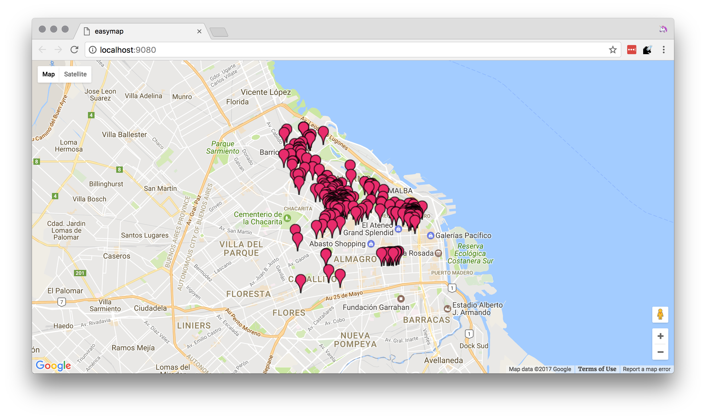

# `easymap`

> 🗺 simplified use of Google Maps API to render a bunch of markers.

# usage

```shell
npm install
```

add your API key to `main.js` by replacing `$YOUR_GOOGLE_MAPS_API_KEY` with your API key.

```js
const apiKey = `$YOUR_GOOGLE_MAPS_API_KEY`
```

add your own places to `data.json` using the following format.

```js
{
  "href": "http://www.estilosdeco.com/negocios/ar/decoracion/agnes-deco/",
  "name": "Agnes Deco",
  "address": "Uriarte 1971, Palermo, Buenos Aires, Argentina"
}
```

then do the following on your shell to start the web server.

```shell
npm start
```

the map will automatically center on the average of every marker.

# demo

using the data which ships with the repo, `easymap` renders the following:



# license

MIT

https://github.com/bevacqua/easymap/blob/master/resources/demo.png
